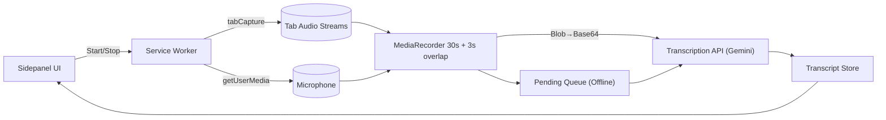

# Chrome-Extension-Real-Time-Audio-Transcription
A Chrome extension that captures audio from the current tab, streams/transcribes in 30‑second chunks (with a 3‑second overlap), and displays live results in a Side Panel. Includes multi‑tab capture, channel labeling (Tab vs Mic), offline buffering, and robust UX/error handling.

---

## ✨ Features

- Capture audio from **audible tabs** and optionally **microphone** at the same time.
- Rolling **30s segments with 3s overlap** to avoid word loss between chunks.
- **Live tab add/remove** while recording — toggle checkboxes to start/stop channels.
- **Status & timer** UI; **Copy / Download (.txt & .json)** exports.
- Resilient **retry queue** for transient network issues (e.g., brief disconnects).
- Uses **Google Gemini (gemini-1.5-flash-latest)** via the Generative Language API.

---

## 🧱 Project Architecture
### -/extension
- [manifest.json](https://github.com/tejabandaru411-ux/Chrome-Extension-Real-Time-Audio-Transcription/blob/main/manifest.json): MV3 manifest; permissions; sidepanel entry; service worker.
- [service-worker.js](https://github.com/tejabandaru411-ux/Chrome-Extension-Real-Time-Audio-Transcription/blob/main/service-worker.js): Opens sidepanel; can help orchestrate background tasks.
- [sidepanel.html](https://github.com/tejabandaru411-ux/Chrome-Extension-Real-Time-Audio-Transcription/blob/main/sidepanel.html)/ [sidepanel.css](https://github.com/tejabandaru411-ux/Chrome-Extension-Real-Time-Audio-Transcription/blob/main/sidepanel.css): UI layout and styles.
- [sidepanel.js](https://github.com/tejabandaru411-ux/Chrome-Extension-Real-Time-Audio-Transcription/blob/main/sidepanel.js): Capture manager, chunking, provider calls, retries, exports.
- [icons](https://github.com/tejabandaru411-ux/Chrome-Extension-Real-Time-Audio-Transcription/tree/main/icons)
  - [icon16.png](https://github.com/tejabandaru411-ux/Chrome-Extension-Real-Time-Audio-Transcription/blob/main/icons/icon16.png)
  - [icon48.png](https://github.com/tejabandaru411-ux/Chrome-Extension-Real-Time-Audio-Transcription/blob/main/icons/icon48.png
)
  - [icon128.png](https://github.com/tejabandaru411-ux/Chrome-Extension-Real-Time-Audio-Transcription/blob/main/icons/icon128.png
)
- [eslint.config.json](https://github.com/tejabandaru411-ux/Chrome-Extension-Real-Time-Audio-Transcription/blob/main/eslint.config.js): ESLint config (code quality)

##  Configure API Key

1. Get a **Google Gemini API Key**: [Google AI Studio](https://aistudio.google.com/apikey)
2. Open the extension side panel in Chrome.
3. Enter your *Google Gemini API key* in the input box.
4. Click *Save Key*. (Stored securely in chrome.storage.local).

---

## 🖥️ Installation 

1. Download the [zip](https://github.com/tejabandaru411-ux/Chrome-Extension-Real-Time-Audio-Transcription/blob/main/Real-Time-Audio-Transcription.zip) file.
2. Open chrome://extensions/ in Chrome.
3. Enable *Developer mode* (top right).
4. Click *Load unpacked*.
5. Select the unzipped version folder.

---

## 🧪 Usage

1. Open a tab with audio (YouTube / Meet).
2. Open *Real time audio transcription* side panel.
3. Choose audible tab(s), enable mic if needed.
4. Click *Start Recording*.

   * Transcript updates every *30s*.
   * Queue + retry works if offline.
   * Multiple tabs are supported.
5. Stop recording → *Export transcript*.

## Demo Video
[Download or watch demo]()

# Architecture & Data Flow

**Key Decisions**
- **MV3 Service Worker** to avoid blocking UI; does chunking and API calls.
- **3-second overlap**: retains the final 3s chunk each window to minimize word boundary loss.
- **Retry**: up to 3 attempts with exponential backoff.
- **Storage**: local key storage via `chrome.storage.local`.
- **Optional Backend**: proxy keeps API key server-side (production-friendly).

**Channels / Labeling (extensible)**
- Current build focuses on tab audio. Microphone and multi-tab capture can be added by extending capture routing and labeling logic.

# Performance Report

## Methodology
- Chrome `chrome://performance` and Task Manager run during a 10-minute session on a 1080p YouTube video.
- MediaRecorder: 3s timeslice; 30s segment assembly; Gemini transcription on each segment.
- Network: Wi‑Fi, ~50 Mbps downlink.

## Observations 
- **CPU**: 3–7% on a 4-core laptop during active recording; brief spikes (8–12%) during base64 encode + fetch.
- **Memory**: Stable; 20–40 MB for the extension process; 30s segment blob typically <1–3 MB (depends on codec).
- **Latency**: API RTT 0.8–2.5s typical; transcription is near-instant once response arrives.

## Optimizations Implemented
- Background worker handles processing; UI remains responsive.
- Minimal DOM updates (append-only, auto-scroll).
- Segment buffer cleared after send; only 3s overlap retained.
- Exponential backoff on errors to reduce thrash.

## Future Optimizations
- Off-main-thread encode (Worklets/Workers) if using heavier transforms.
- Option to reduce chunk size or bitrate when CPU constrained.
- Batch export and virtualized transcript list for very long sessions.
- Multiple language transcription.

# Known Limitations & Future Work

- Gemini API is *chunk-based* (not full streaming) → small delay in transcript updates.
- Chrome requires temporary *tab activation* for audio capture across multiple tabs.
- Very long sessions may consume browser memory — recommend exporting periodically.

